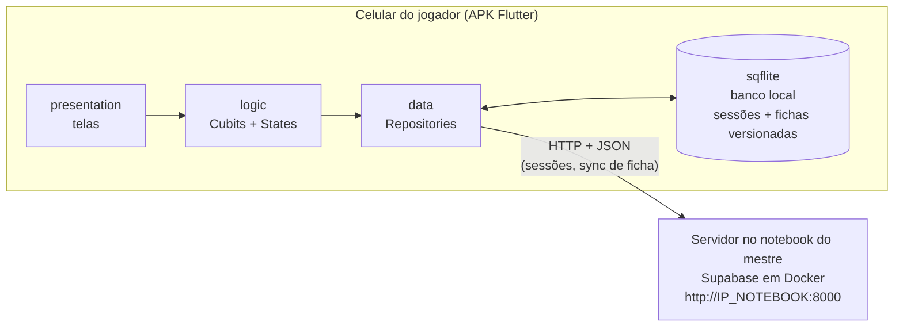
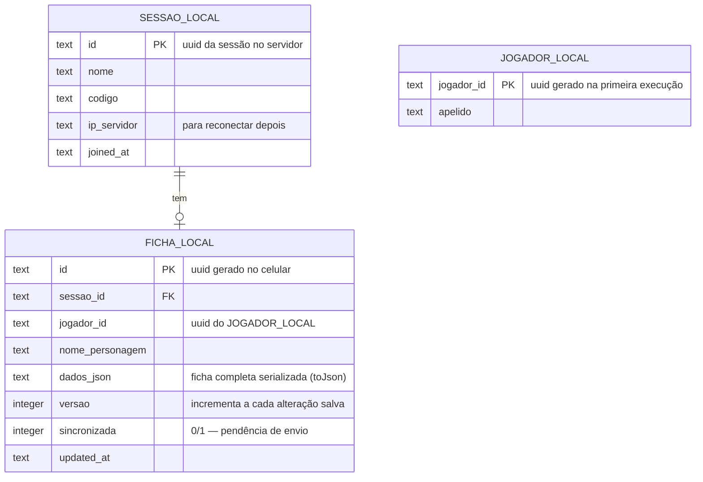

# Arquitetura — APK do Jogador (App Flutter Android)

Aplicativo instalado no celular dos **jogadores** (o mestre não usa o APK). O celular se conecta à rede Wi-Fi criada pelo notebook do mestre; a ficha do personagem vive **primeiro no banco local do celular** (sqflite) e o próprio app é o responsável por **exportá-la em JSON e sincronizá-la** com o servidor quando conectado.

> **Escopo atual:** o app só conecta fichas às sessões e as mantém sincronizadas, **sem autenticação** — o jogador entra com o **código disponibilizado pelo mestre ao iniciar a sessão**. Pode participar de várias sessões, com **uma ficha por sessão**, e vê **somente as próprias fichas**. A ficha é tratada como uma estrutura genérica (nome + JSON versionado) — **o conteúdo e o processo de criação da ficha serão definidos depois** sem impacto nesta arquitetura, pois o JSON é opaco para o sync e para o servidor.

---

## 1. Visão geral



Fluxo de dados idêntico ao das aulas: `Screen → Cubit → Repository → (sqflite | http) → State → Screen (BlocBuilder)`.

## 2. Estrutura do app (padrão do professor)

```
lib/
├── main.dart                          # MultiRepositoryProvider + MultiBlocProvider + rotas nomeadas
├── data/
│   ├── local/
│   │   └── database_helper.dart       # singleton sqflite (padrão da aula "codigo sqlite")
│   ├── models/
│   │   ├── jogador_model.dart         # uuid gerado no app + apelido (identidade local, sem login)
│   │   ├── sessao_model.dart
│   │   └── ficha_model.dart           # fromJson/toJson — o toJson É o formato exportado ao servidor
│   └── repositories/
│       ├── jogador_repository.dart    # gera/lê o uuid e o apelido no sqflite
│       ├── sessao_repository.dart     # valida código, grava pareamento, lista sessões locais
│       ├── ficha_local_repository.dart# CRUD da ficha no sqflite (incrementa versão a cada save)
│       └── ficha_sync_repository.dart # exporta JSON e sincroniza com o servidor
├── logic/
│   ├── sessao_cubit.dart / sessao_state.dart
│   ├── ficha_cubit.dart / ficha_state.dart
│   └── sync_cubit.dart / sync_state.dart   # estados: SyncIdle / Syncing / Synced / SyncError(pendente)
└── presentation/screens/
    ├── minhas_sessoes_screen.dart     # "Minhas sessões RPG"
    ├── entrar_sessao_screen.dart      # IP do servidor + código da sessão
    └── ficha_screen.dart              # criar/editar a ficha da sessão (estrutura mínima por enquanto)
```

## 3. Banco local (sqflite) — fonte primária da ficha

Segue o `DatabaseHelper` singleton da aula, com duas tabelas:



- A tela **"Minhas sessões RPG"** é alimentada por `SESSAO_LOCAL` — funciona mesmo sem rede, mostrando toda sessão em que o jogador já entrou.
- **Toda alteração salva na ficha**: regrava `dados_json`, faz `versao = versao + 1` e marca `sincronizada = 0`.
- A ficha inteira trafega e é armazenada como **JSON** (formato de exportação escolhido; gerado pelo `toJson()` do model, como nas aulas).

## 4. Fluxos do jogador

1. **Identidade local (sem login)** — na primeira execução o app gera um `jogador_id` (UUID) e pede um apelido; ficam no sqflite (`JOGADOR_LOCAL`) e acompanham todo pareamento e ficha enviados ao servidor.
2. **Entrar em sessão** — informa IP do servidor (uma vez) + **código da sessão fornecido pelo mestre** → app valida em `/rest/v1/sessoes?codigo=eq.ABC123`, grava o pareamento (`jogador_id` + apelido) em `/rest/v1/sessao_jogadores` e salva a sessão em `SESSAO_LOCAL`. Jogador pareado.
3. **Minhas sessões RPG** — lista local; ao tocar numa sessão, abre a ficha daquela sessão (ou a criação, se ainda não existir). O jogador só vê as próprias fichas.
4. **Criar ficha** — por enquanto, estrutura mínima (nome do personagem + corpo em JSON); grava no sqflite com `versao = 1`. *O que a ficha contém e como será o auxílio de criação ficam para uma etapa futura — só muda o conteúdo de `dados_json`, sem alterar o sync.*
5. **Editar ficha** — sempre salva localmente primeiro (nunca depende da rede), incrementando a versão.

## 5. Sincronização — responsabilidade do app do celular

Gatilhos de envio (`SyncCubit` → `ficha_sync_repository`):

- **Ao conectar** na rede do mestre / abrir uma sessão;
- **A cada alteração salva** na ficha (se houver rede; senão fica `sincronizada = 0` e tenta no próximo gatilho).

```mermaid
sequenceDiagram
    participant A as APK (SyncCubit)
    participant L as sqflite local
    participant S as Servidor (Supabase no notebook)

    A->>L: lê ficha (dados_json, versao local)
    A->>S: GET /rest/v1/fichas?id=eq.<uuid>&select=versao
    alt ficha não existe no servidor
        A->>S: POST /rest/v1/fichas (JSON completo + versao)
    else versao do servidor < versao local
        A->>S: PATCH /rest/v1/fichas?id=eq.<uuid> (JSON completo + versao)
    else versões iguais
        A->>A: nada a fazer
    end
    S-->>A: 200/201
    A->>L: marca sincronizada = 1
    Note over A,S: Falhou a rede? Ficha continua local com sincronizada = 0;<br/>novo envio no próximo gatilho (padrão offline da aula "codigo sqlite")
```

Regras do modelo (simples de defender no trabalho):

- **O celular é a fonte da verdade da ficha** — só o dono edita; o servidor guarda a cópia mais recente para o mestre consultar.
- **Maior versão vence**: o servidor nunca sobrescreve o celular; o celular atualiza o servidor quando está à frente.
- É a extensão natural do padrão visto em aula: lá, nuvem→local (cache offline); aqui, acrescenta-se **local→servidor com número de versão**.

## 6. Tecnologias usadas (todas ancoradas nas aulas)

| Item | Escolha | Origem na aula |
|---|---|---|
| App Android (APK) | Flutter + camadas `data/logic/presentation` | Todas as aulas |
| Gestão de estado | Cubit (`flutter_bloc`), estados Initial/Loading/Loaded/Error, `BlocBuilder`/`BlocConsumer` | 11/06, 18/06, 25/06 |
| Banco local | `sqflite` + `path`, `DatabaseHelper` singleton | "codigo sqlite" |
| Comunicação | `http` + `dart:convert` (JSON), filtros PostgREST `?col=eq.valor` | 18/06-API, 25/06 |
| Identificação | **Sem autenticação**: UUID gerado no app + apelido + código de sessão | Simplificação do projeto (Supabase Auth da aula 25/06 fica como evolução futura) |
| Exportação da ficha | JSON via `toJson()` do model | 18/06-API |
| Offline + sync | Padrão de cache offline da aula, estendido com versionamento | "codigo sqlite" |
| Navegação | Rotas nomeadas + `arguments` | 25/06 |
