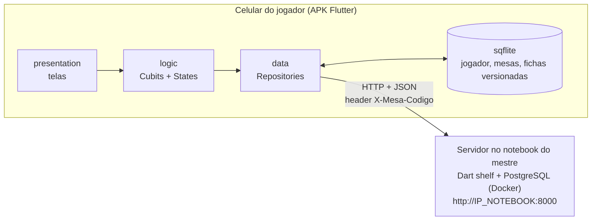
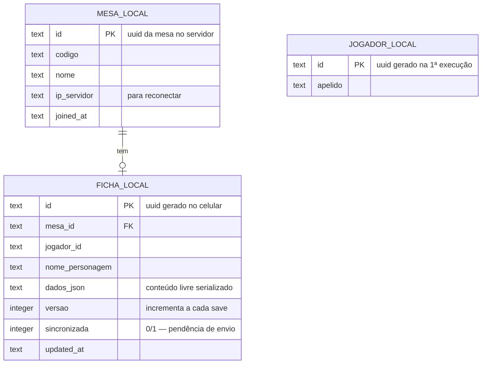

# Arquitetura — APK do Jogador (App Flutter Android, como foi implementado)

Aplicativo instalado no celular dos **jogadores** (o mestre não usa o APK). O celular se conecta à rede do notebook do mestre; a ficha vive **primeiro no banco local do celular** (sqflite) e o próprio app **exporta em JSON e sincroniza** com o servidor quando há rede.

> **Sem autenticação.** O jogador entra na mesa com o **código** fornecido pelo mestre, enviado no header `X-Mesa-Codigo`. Pode participar de **várias mesas**, com **uma ficha por mesa**. A identidade é um **UUID gerado no app** (na 1ª execução) + um **apelido** — sem login. A ficha é, nesta versão inicial, um **texto livre** guardado como JSON (`{"conteudo": "..."}`), versionado.
>
> Alvo validado: **Xiaomi Mi 13, Android 14** (build UKQ1.231207.002). APK release assinado com a chave de debug (instalação por "fontes desconhecidas").

---

## 1. Visão geral



Fluxo idêntico ao das aulas: `Screen → Cubit → Repository → (sqflite | http) → State → Screen (BlocBuilder)`.

## 2. Estrutura do app (`app-jogador/`)

```
lib/
├── main.dart                         # MultiRepositoryProvider + MultiBlocProvider; _Gate decide a tela inicial
├── data/
│   ├── local/
│   │   └── database_helper.dart      # singleton sqflite (padrão da aula "codigo sqlite")
│   ├── models/
│   │   ├── jogador_model.dart        # uuid + apelido
│   │   ├── mesa_model.dart           # id, codigo, nome, ip_servidor
│   │   └── ficha_model.dart          # dados_json, versao, sincronizada; paraEnvio() = corpo do POST
│   └── repositories/
│       ├── jogador_repository.dart   # gera/lê o uuid + apelido no sqflite
│       ├── mesa_repository.dart      # valida código (GET /mesa/info) e salva a mesa local
│       └── ficha_repository.dart     # CRUD local (incrementa versão) + sincronização com o servidor
├── logic/
│   ├── jogador_cubit.dart / _state   # JogadorCarregando / SemJogador / ComJogador
│   ├── mesa_cubit.dart / _state      # Carregando / Carregada / Erro
│   └── ficha_cubit.dart / _state     # Inicial / Salvando / Salva / Erro
└── presentation/screens/
    ├── identidade_screen.dart        # 1ª execução: apelido (gera o UUID)
    ├── minhas_mesas_screen.dart      # "Minhas mesas" (lista local) + FAB "Entrar em mesa"
    ├── entrar_mesa_screen.dart       # endereço do servidor (IP) + código
    └── ficha_screen.dart             # nome + caixa de texto livre; salvar e sincronizar
```

`android/app/src/main/AndroidManifest.xml`: permissão **INTERNET** + `android:usesCleartextTraffic="true"` (a API é `http://` na rede local).

## 3. Banco local (sqflite) — fonte primária da ficha



- A tela **"Minhas mesas"** é alimentada por `MESA_LOCAL` — funciona sem rede.
- Cada save da ficha regrava `dados_json`, faz `versao = versao + 1` e marca `sincronizada = 0`.
- `FICHA_LOCAL` é **única por `mesa_id`** → uma ficha por mesa.

## 4. Fluxos do jogador

1. **Identidade local (sem login)** — 1ª execução: o app gera um `id` (UUID) e pede um `apelido`; ficam em `JOGADOR_LOCAL`. O UUID é o `jogador_id` enviado ao servidor.
2. **Entrar em mesa** — informa o **endereço do servidor** (IP do notebook, ex.: `http://192.168.137.1:8000`) + o **código**. O app valida em `GET /mesa/info` (header `X-Mesa-Codigo`) e salva em `MESA_LOCAL`.
3. **Minhas mesas** — lista local; tocar abre a ficha daquela mesa.
4. **Criar/editar ficha** — campo "Nome do personagem" + **caixa de texto livre** (com um modelo de campos pré-preenchido). Salva sempre local primeiro (nunca depende da rede), incrementando a versão.

## 5. Sincronização — responsabilidade do app

Gatilho: **ao salvar** a ficha. O app grava local (`sincronizada = 0`) e faz `POST /mesa/fichas` com o corpo `{jogador_id, nome_personagem, versao, dados}` e o header `X-Mesa-Codigo`. **O servidor decide** ("maior versão vence"): se não tiver aquela versão, grava. Em caso de `2xx`, o app marca `sincronizada = 1`.

```mermaid
sequenceDiagram
    participant A as APK (FichaCubit)
    participant L as sqflite local
    participant S as Servidor (notebook)

    A->>L: salva ficha (dados_json, versao+1, sincronizada=0)
    A->>S: POST /mesa/fichas (header X-Mesa-Codigo, JSON + versao)
    alt 200/201 (criada/atualizada/inalterada)
        A->>L: sincronizada = 1
    else sem rede / erro
        Note over A,L: fica sincronizada = 0; reenvia no próximo save
    end
```

Regras do modelo:

- **O celular é a fonte da verdade da ficha**; o servidor guarda a cópia mais recente para o mestre consultar.
- **Maior versão vence**: o servidor nunca sobrescreve o celular com uma versão menor.
- Extensão do padrão de cache offline das aulas, acrescentando **versão + envio local→servidor**.

## 6. Tecnologias usadas

| Item | Escolha | Origem |
|---|---|---|
| App Android (APK) | Flutter + camadas `data/logic/presentation` | Aulas |
| Gestão de estado | Cubit (`flutter_bloc`), `BlocBuilder`/`BlocConsumer` | Aulas 11/06–25/06 |
| Banco local | `sqflite` + `path`, `DatabaseHelper` singleton | Aula "codigo sqlite" |
| Comunicação | `http` + `dart:convert` (JSON) | Aulas 18/06 e 25/06 |
| Identificação | **Sem login**: UUID gerado no app + apelido + código da mesa (header) | Simplificação do projeto |
| Build | `flutter build apk --release` via Docker (`ghcr.io/cirruslabs/flutter`) | Sem Flutter local |

## 7. Build e instalação

```bash
docker run --rm -v "$(pwd)/app-jogador:/app" -w /app \
  ghcr.io/cirruslabs/flutter:stable \
  bash -c "flutter clean && flutter pub get && flutter build apk --release"
# APK: app-jogador/build/app/outputs/flutter-apk/app-release.apk
```

Copiar o `.apk` para o celular e instalar habilitando "instalar de fontes desconhecidas".
