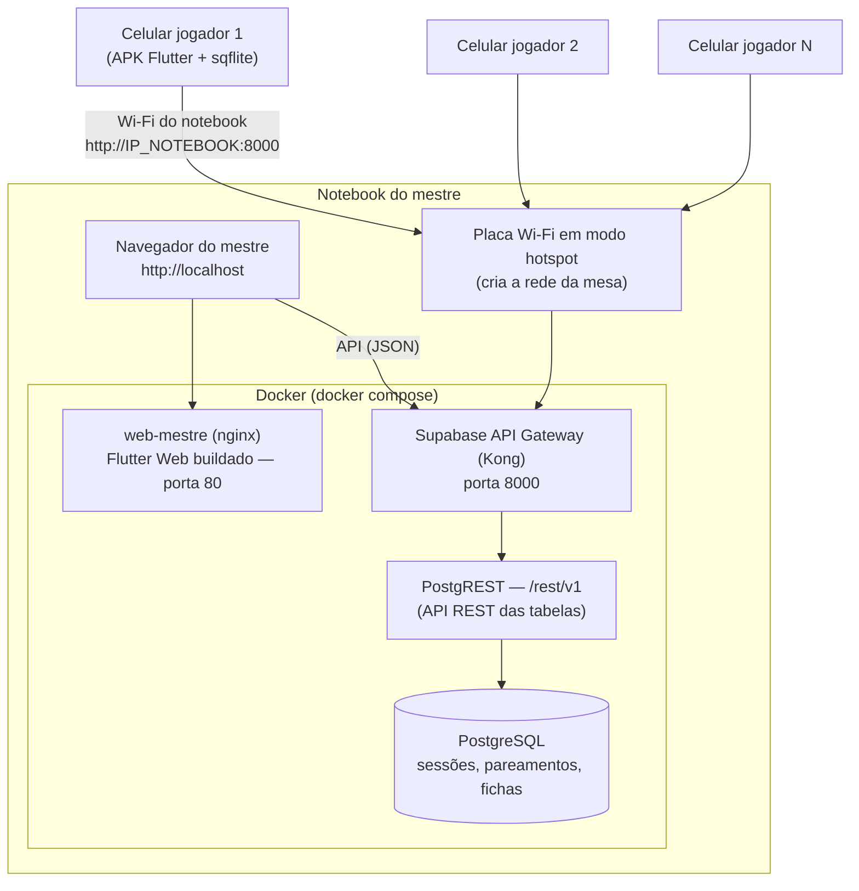
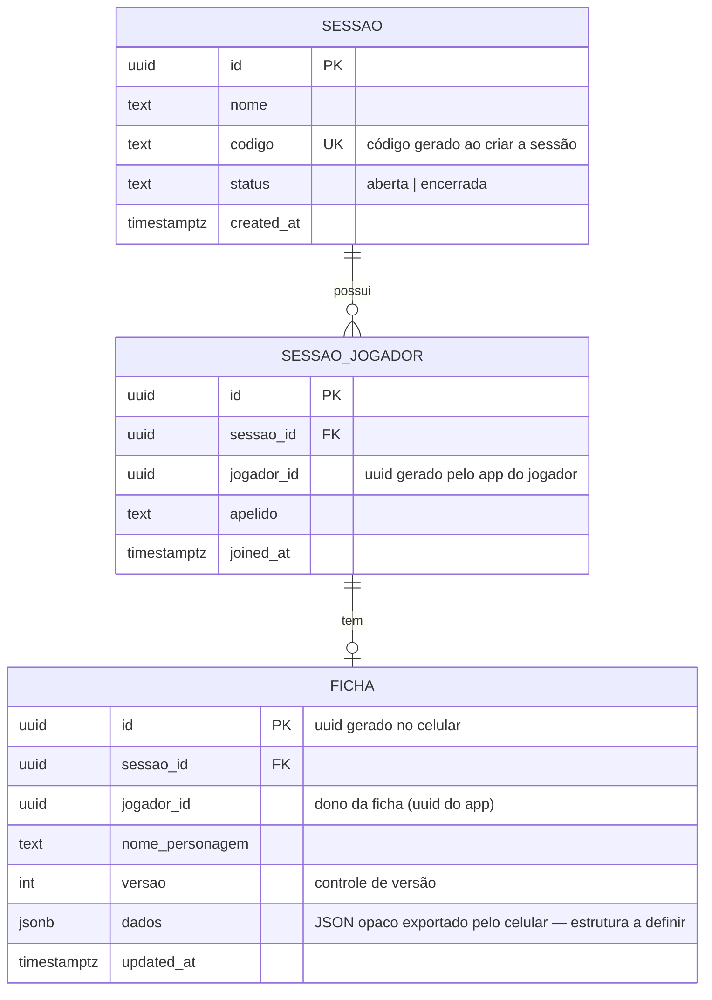
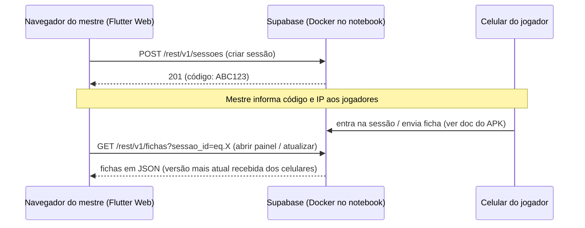

# Arquitetura — Aplicação do Notebook (Servidor + Painel do Mestre)

O notebook do mestre é ao mesmo tempo o **servidor da mesa** (Docker) e o **ponto de acesso Wi-Fi** da rede. O mestre usa a aplicação pelo **navegador**; os celulares dos jogadores se conectam à rede Wi-Fi criada pelo notebook e falam com o servidor por HTTP.

> **Escopo atual:** o sistema só conecta fichas às sessões e as mantém sincronizadas, **sem autenticação** — o acesso é pelo **código gerado ao criar/iniciar a sessão**. O **mestre** cria sessões e vê **todas as fichas** de cada sessão; o **jogador** conecta na sessão pelo código e vê **somente as suas** (uma ficha por sessão, podendo participar de várias sessões). A ficha é armazenada como JSON genérico versionado — **o conteúdo da ficha será definido depois**, sem impacto no servidor, que trata o JSON como opaco.

---

## 1. Topologia física e de rede



- **Rede**: o notebook ativa o hotspot do sistema operacional (Windows: *Hotspot móvel*, IP padrão `192.168.137.1`; Linux/NetworkManager: IP padrão `10.42.0.1`). Não é necessário internet — a rede é apenas local.
- **Somente jogadores** (não-mestre) conectam pelo celular. O mestre usa o navegador na própria máquina (`localhost`).
- Os celulares acessam o servidor pelo **IP do notebook na rede do hotspot**, informado pelo mestre junto com o código da sessão.

## 2. Contêineres (docker compose)

| Contêiner | Papel | Porta no host | Tecnologia de referência |
|---|---|---|---|
| `web-mestre` | Serve o build **Flutter Web** do painel do mestre | 80 | Flutter (mesmo framework das aulas), nginx só como servidor de arquivos estáticos |
| Supabase self-hosted (Kong, PostgREST, PostgreSQL) | Backend: API REST + banco (módulo de autenticação presente na distribuição, mas **não utilizado**) | 8000 (API), 5432 (interno) | O **mesmo Supabase consumido nas aulas**, apenas hospedado localmente (distribuição oficial em Docker Compose); acesso com a `apikey`, como na aula 18/06-API |

O "banco local do servidor" é o **PostgreSQL dentro do Docker**, com volume persistente no disco do notebook. Nenhum backend é programado à mão: a API REST das tabelas é gerada pelo PostgREST, exatamente como o professor usa.

## 3. Painel do mestre (Flutter Web)

Mesma arquitetura em camadas das aulas — o código é Flutter comum compilado para web:

```
web-mestre (Flutter Web)
├── data/
│   ├── models/          sessao_model, ficha_model
│   └── repositories/    sessao_repository (CRUD /rest/v1/sessoes, /rest/v1/sessao_jogadores)
│                        ficha_repository (GET /rest/v1/fichas?sessao_id=eq.X)
├── logic/               sessao_cubit, ficha_cubit (+ states Initial/Loading/Loaded/Error)
└── presentation/        sessoes_screen, painel_sessao_screen
```

Funcionalidades do mestre (sem login — o painel abre direto em `localhost`):

1. **Criar nova sessão** → o app gera o **código da sessão** (6 caracteres alfanuméricos, coluna `UNIQUE`), grava em `sessoes` e **exibe o código na tela**; o mestre fornece o código (e o IP) aos jogadores.
2. **Iniciar/retomar sessão** → lista as sessões existentes no servidor; ao abrir uma, vê os jogadores pareados e as fichas.
3. **Painel de fichas** → lista **todas as fichas da sessão** (nome do personagem, dono, versão, última atualização; o conteúdo do JSON é exibido de forma genérica por enquanto). **A atualização é via API** (`GET /rest/v1/fichas?sessao_id=eq.<id>`), disparada ao abrir a tela e por botão/pull de atualização — padrão REST + Cubit das aulas, sem websocket.

## 4. Modelo de dados (PostgreSQL no servidor)



- **Não há tabela de usuários**: o jogador é identificado por um **UUID gerado pelo próprio app** na primeira execução + um apelido informado ao entrar na sessão. O mestre é simplesmente quem usa o painel no notebook.
- A ficha chega do celular como **JSON completo** e é armazenada na coluna `dados` (JSONB); `versao` é o campo de comparação.
- **Controle de acesso no nível da aplicação** (aceitável em rede local confiável): o APK sempre consulta fichas filtrando `?jogador_id=eq.<seu_uuid>`; o painel do mestre consulta por sessão, sem filtro de jogador.

## 5. Papel do servidor na sincronização de fichas

O servidor é **passivo**: quem decide enviar é o aplicativo do celular (ver documento do APK). O contrato é:

1. Celular conecta (ou salva uma alteração) → consulta `GET /rest/v1/fichas?id=eq.<uuid>&select=versao`.
2. Se a ficha não existe no servidor → `POST /rest/v1/fichas` (JSON completo).
3. Se `versao` do servidor **<** `versao` local → `PATCH /rest/v1/fichas?id=eq.<uuid>` com o JSON e a nova versão. O servidor fica sempre com a ficha mais atual do jogador.
4. Se as versões são iguais → nada a fazer.

> Evolução opcional (mais robusta, ainda REST): uma função SQL `sync_ficha(json)` exposta pelo PostgREST em `POST /rest/v1/rpc/sync_ficha`, que faz o upsert-se-mais-novo de forma atômica no banco. Continua sendo uma chamada `http.post` como nas aulas.



## 6. Tecnologias usadas (todas ancoradas nas aulas)

| Item | Escolha | Origem na aula |
|---|---|---|
| Painel do mestre | Flutter (Web) + Cubit + Repository | Aulas 11/06–25/06 |
| API do servidor | Supabase PostgREST (`/rest/v1`) com `apikey` | Aula 18/06-API |
| Identificação | **Sem autenticação**: código de sessão + UUID gerado no app do jogador (Supabase Auth da aula 25/06 fica como evolução futura) | Simplificação do projeto |
| Banco do servidor | PostgreSQL (do Supabase) | Aulas 18/06 e 25/06 (mesmo banco, agora local) |
| Comunicação | HTTP + JSON (pacote `http`) | Aulas 18/06 e 25/06 |
| Empacotamento | Docker Compose (Supabase self-hosted + nginx) | Exigência do projeto — único item fora do material de aula |
