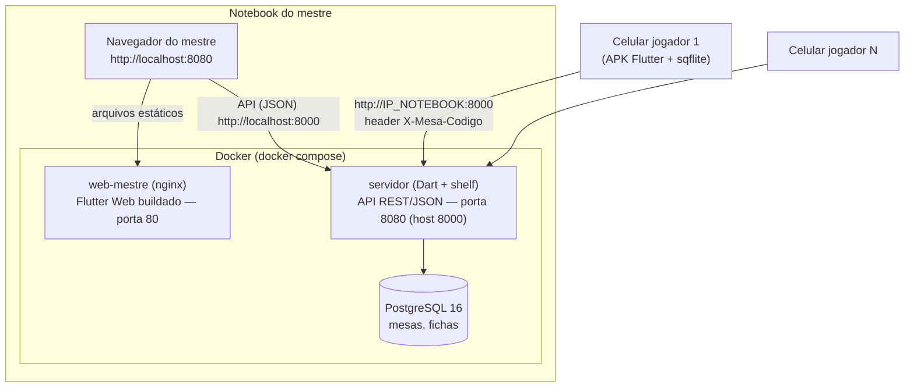
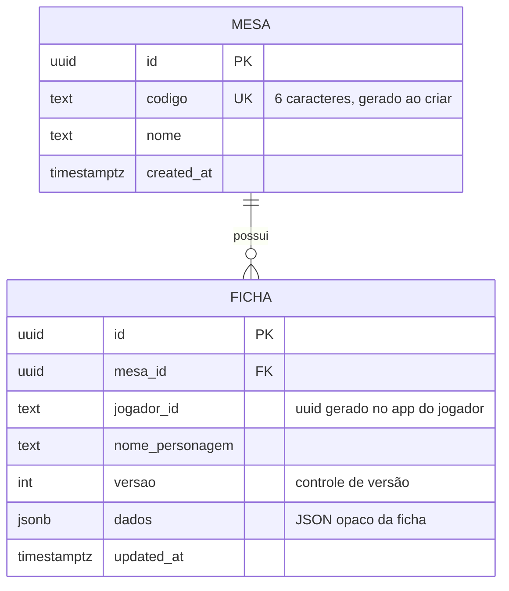
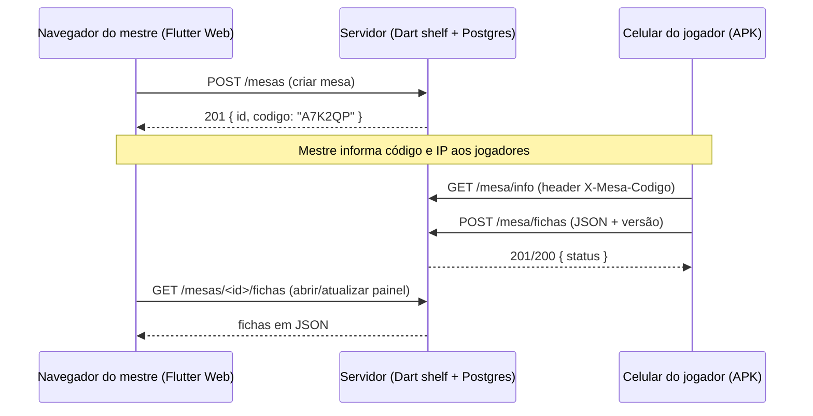

# Arquitetura — Servidor + Painel do Mestre (como foi implementado)

O notebook do mestre é ao mesmo tempo o **servidor da mesa** (Docker) e o **ponto de acesso** da rede. O mestre usa a aplicação pelo **navegador** (`localhost`); os celulares dos jogadores se conectam à mesma rede e falam com o servidor por **HTTP + JSON**.

> **Sem Supabase.** A arquitetura original previa Supabase (PostgREST/Kong). Isso foi **abandonado**. Hoje o backend é uma **API própria em Dart + `shelf`** com **PostgreSQL local**, empacotada em Docker.
>
> **Sem autenticação.** O acesso é pelo **código da mesa** (6 caracteres) gerado ao criar a mesa. O **mestre** cria mesas e vê **todas as fichas**; o **jogador** entra pelo código (enviado no header `X-Mesa-Codigo`) e envia a própria ficha. "Sessão" foi renomeada para **"Mesa"** (mesa de RPG). A ficha é um **JSON opaco versionado** — o conteúdo será detalhado depois, sem impacto no servidor.

---

## 1. Topologia física e de rede



- **Rede local**, sem internet. Os celulares acessam a API pelo **IP do notebook** na rede (Wi-Fi comum ou *Hotspot móvel* do Windows, IP padrão `192.168.137.1`).
- **Somente jogadores** usam o celular. O mestre usa o navegador na própria máquina (`localhost`).
- O celular só precisa da **porta 8000** (API). A `8080` (painel) é usada só no navegador do notebook.

## 2. Contêineres (docker compose)

| Contêiner | Papel | Porta host → contêiner | Tecnologia |
|---|---|---|---|
| `db` | Banco de dados do servidor | `5432 → 5432` | PostgreSQL 16 (volume persistente `db-data`) |
| `servidor` | API REST (JSON) | `8000 → 8080` | Dart + `shelf`/`shelf_router` + `postgres`; compilado para executável nativo (imagem `scratch`) |
| `web-mestre` | Painel do mestre | `8080 → 80` | Flutter Web (build) servido por nginx |

As tabelas são criadas pelo próprio servidor no startup (`CREATE TABLE IF NOT EXISTS`), com *retry* enquanto o Postgres sobe.

## 3. API do servidor (`servidor/`)

```
servidor/
├── bin/server.dart      # pipeline: logRequests + CORS + tratarErros + rotas
└── lib/src/
    ├── db.dart          # pool PostgreSQL, migração, queries, regra de sync
    ├── middleware.dart   # CORS, erros→JSON, exigirCodigoMesa (header)
    └── router.dart      # rotas do mestre e do jogador (shelf_router)
```

**Rotas do mestre** (navegador em `localhost`, sem código):

| Método | Rota | Descrição |
|---|---|---|
| `POST` | `/mesas` | Cria mesa `{"nome":"..."}`; servidor **gera código + id**; retorna `201`. |
| `GET` | `/mesas` | Lista mesas. |
| `GET` | `/mesas/<id>` | Detalhe da mesa. |
| `GET` | `/mesas/<id>/fichas` | Todas as fichas da mesa (visão do mestre). |
| `DELETE` | `/mesas/<id>` | Remove a mesa (fichas em cascata). |

**Rotas do jogador** (exigem header `X-Mesa-Codigo`; sem header → `401`, código inválido → `403`):

| Método | Rota | Descrição |
|---|---|---|
| `GET` | `/mesa/info` | Valida o código e retorna a mesa. |
| `GET` | `/mesa/fichas` | Fichas da mesa (aceita `?jogador_id=`). |
| `GET` | `/mesa/fichas/<jogadorId>` | Ficha de um jogador (checagem de versão). |
| `POST` | `/mesa/fichas` | Cria/sincroniza a ficha. |

## 4. Painel do mestre (Flutter Web — `web-mestre/`)

Arquitetura em camadas `data / logic / presentation`, Cubit (`flutter_bloc`) e `http` — padrão das aulas.

```
web-mestre/lib/
├── data/
│   ├── api_config.dart      # URL da API (dart-define API_URL; default http://localhost:8000)
│   ├── models/              # mesa_model, ficha_model (fromJson/toJson)
│   └── repositories/        # mesa_repository: http + cache no navegador (shared_preferences)
├── logic/                   # mesa_cubit, ficha_cubit (+ states Inicial/Carregando/Carregada/Erro)
└── presentation/
    ├── home_shell.dart      # NavigationRail recolhível (hambúrguer); abas "Nova mesa" e "Minhas mesas" (ícone de mapa)
    └── screens/             # nova_mesa, minhas_mesas, painel_mesa
```

Funcionalidades:

1. **Criar mesa** → chama `POST /mesas`; o servidor gera o **código** (exibido em destaque, com copiar) e o **id interno**. A mesa é salva no **cache do navegador** (`shared_preferences` → localStorage): como não há login, o cache é a "memória" do mestre.
2. **Minhas mesas** → lista do cache; tocar abre o painel.
3. **Painel da mesa** → mostra o código e busca `GET /mesas/<id>/fichas`, listando **todas as fichas** (nome, jogador, versão; o JSON é exibido de forma genérica), com botão atualizar.

## 5. Modelo de dados (PostgreSQL)



- **Uma tabela `fichas` com `mesa_id`** (não uma tabela física por mesa): isola as fichas por mesa de forma simples. Única por `(mesa_id, jogador_id)` → uma ficha por jogador por mesa.
- **Sem tabela de usuários**: o jogador é identificado pelo `jogador_id` (UUID gerado no app). O mestre é quem usa o painel no notebook.

## 6. Sincronização (regra "maior versão vence")

O servidor é **passivo**: quem envia é o app do celular. No `POST /mesa/fichas` (corpo `{jogador_id, nome_personagem, versao, dados}`):

1. Ficha não existe no servidor → **cria** (`201`, `status: criada`).
2. `versao` recebida **>** a do servidor → **atualiza** (`200`, `status: atualizada`).
3. `versao` **<=** a do servidor → **nada a fazer** (`200`, `status: inalterada`).



## 7. Tecnologias usadas

| Item | Escolha | Origem |
|---|---|---|
| Painel do mestre | Flutter (Web) + Cubit + Repository + `http` | Aulas 11/06–25/06 |
| API do servidor | **Dart + `shelf`/`shelf_router`** | Novo (linguagem das aulas; substitui PostgREST/Supabase) |
| Banco do servidor | **PostgreSQL 16** em Docker | Aulas (mesmo banco, agora local e sem Supabase) |
| Comunicação | HTTP + JSON (`http` / `dart:convert`) | Aulas 18/06 e 25/06 |
| "Auth" do jogador | Código da mesa no header `X-Mesa-Codigo` | Simplificação do projeto |
| Cache do mestre | `shared_preferences` (localStorage no Web) | Necessário no Web (sqflite não roda no navegador) |
| Empacotamento | Docker Compose (Postgres + servidor Dart + nginx) | Exigência do projeto |
